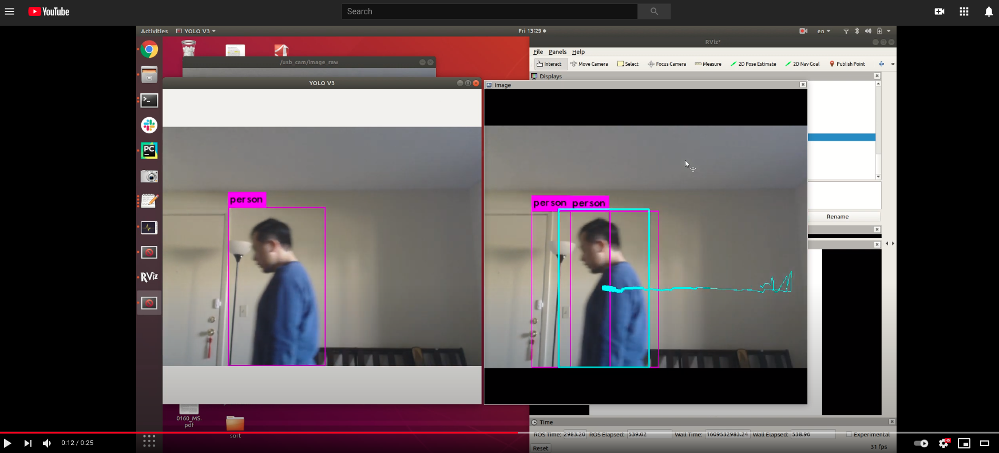

# ros_iou_tracking
A ROS package that applies multiple object tracking (MOT) to YOLO detection

## Requirements
#### 1. Realtime object detector  
[leggedrobotics/darknet_ros](https://github.com/leggedrobotics/darknet_ros): A ROS package for YOLO detection

#### 2. Multiple object tracker  
[abewley/sort](https://github.com/abewley/sort): simple online realtime tracker  

## Pipeline
1. train YOLO with your own data
2. launch darknet_ros with well-trained YOLO
3. launch ros_sort

#### 1. Webcam test
ROS package [usb_cam](https://wiki.ros.org/usb_cam) is used to launch webcam. The image topic name should also be changed in `darknet_ros/darknet_ros/config/ros.yaml`.
```buildoutcfg
roslaunch usb_cam usb_cam-test.launch
roslaunch darknet_ros darknet_ros.launch
rosrun ros_iou_tracking iou_tracker.py
```
[](https://youtu.be/b8CMsl72Xr4)

#### 2. Gazebo test (rosbag)
```buildoutcfg
roslaunch ros_iou_tracking rosbag_pbr_test.launch
```


## Semi-automatic annotation (todo)
1. train YOLO with a small set of annotations
2. automate annotation augmentation using offline object tracking
3. correct automatic annotations if necessary
4. retrain YOLO with previous and augmented data

## Topics
Node: /iou_tracker_node  
Publications: 
 * /iou_tracker/bounding_boxes [darknet_ros_msgs/BoundingBoxes]
 * /iou_tracker/detection_image [sensor_msgs/Image]

Subscriptions: 
 * /bounding_boxes_drop [darknet_ros_msgs/BoundingBoxes]
 * /darknet_ros/detection_image [sensor_msgs/Image]


## Related work
#### Mutiple object tracking
1. [bochinski/iou-tracker](https://github.com/bochinski/iou-tracker)  
[The original IoU tracker](http://elvera.nue.tu-berlin.de/files/1517Bochinski2017.pdf) is also using IoU information. However, it does not have Kalman filter (and Hungarian algorithm) for tracking, and only uses IoU for target association. It has several strict requirements:  
(1) there should be no detection gaps among frames; otherwise the tracked target will be removed.  
(2) the frame rate should be high enough so the IoU thresholds are guaranteed between successive frames.  
[The extended work](http://elvera.nue.tu-berlin.de/files/1547Bochinski2018.pdf) allows detection gaps by allowing bounding boxes that do not have new detections stay at the last position for several frames. Not only does it fill the detection gaps forward, it also does so backwards, which makes it less ideal for realtime tracking. Also, compared with SORT, predicting bounding box using Kalman filter that has considered the bounding box velocity is a better appoach to having undetected bounding box stay at the last position, when the camera motion is smooth.  

## Acknowledgement
[sort.py] is adapted from [abewley/sort](https://github.com/abewley/sort) to support large detection gaps.